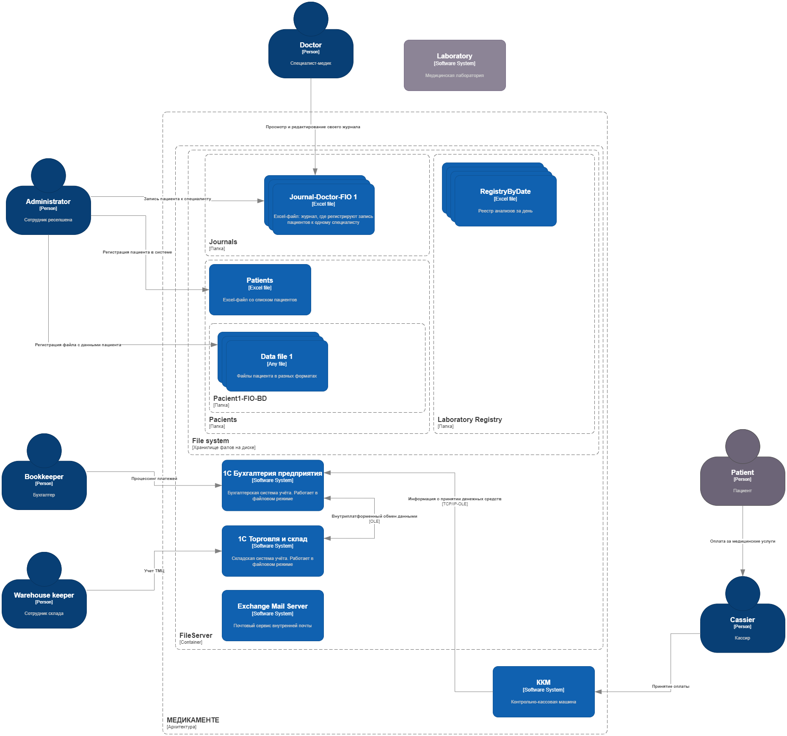

# Проектная работа 10 спринта

Этот проект будет посвящён кейсу компании «Медикаменте». 

Для начала необходимо познакомиться с самой компанией — чем она занимается и с какими проблемами сталкивается.

## О компании
Компания «Медикаменте» предоставляет медицинские услуги. Сейчас у компании есть один офис, в котором работают 20 административных сотрудников и 15 медицинских специалистов.

Все операции с данными команда производит вручную.

- Журналы приёма пациентов, учёт пациентов и платежей, медицинские карты, учёт анализов ― в файлах Excel или хранят в виде сканов. Материалы лежат на общем диске.
- Учёт денежных средств — в «1С:Бухгалтерия предприятия». С ней интегрированы контрольно-кассовые машины (ККМ).
- Учёт товарно-материальных ценностей (ТМЦ) — в «1С:Торговля и склад». Программа интегрирована с «1С:Бухгалтерия предприятия».

В этом году компания собирается открывать новые филиалы. Руководство ожидает, что число клиентов кратно возрастёт.

Ваша задача — автоматизировать всю работу таким образом, чтобы компания смогла поддержать пятикратный рост объёма данных и расширение команды.

Поскольку «Медикаменте» будет активно нанимать новых сотрудников, необходимо усилить безопасность медицинских карт. 
Они содержат конфиденциальные данные, которые необходимо защитить от несанкционированного доступа и утечек.

В будущем компания хочет уйти от ручной записи клиентов и перейти на единую систему хранения и управления данными. 
Она объединит журналы приёма пациентов, учёт пациентов и учёт оплаты услуг. 
Планируется, что система будет поддерживать мобильное приложение, в котором клиенты смогут самостоятельно записаться к врачу через личный кабинет (ЛК).

## Проблемы компании

Компания обслуживает пациентов на территории Российской Федерации. 
Технический директор «Медикаменте» видит, что работа с конфиденциальными данными и PII не в полной мере отвечает требованиям российского законодательства. 
Это создаёт репутационные и финансовые риски для компании. Если информация о нарушениях дойдёт до СМИ, «Медикаменте» потеряет доверие клиентов.

Исходя из этого, технический директор сформулировал две бизнес-потребности.
- Изменить парадигму хранения и учёта конфиденциальных данных. Она должна соответствовать принципам и требованиям законодательства РФ.
- Снизить риски утечки данных, чтобы увеличить доверие и лояльность клиентов.

## Текущее состояние архитектуры
У технологической базы компании довольно простой ландшафт. 
Есть несколько бэк-офис-сервисов, которые закрывают разные потребности. 
Все IT-продукты построены на разных архитектурных принципах (монолит, общие ресурсы) и развёрнуты на собственном сервере компании. Он находится в том же здании, что и офис.

Технологический стек компании выглядит так:

- Excel, Outlook и 1С. Их используют для работы на компьютерах в локальной сети компании.
- «1С:Бухгалтерия предприятия». Программа работает в файловом режиме. Её используют для учёта платежей, начисления зарплаты, кадрового учёта и подготовки документации для налоговых органов.
- «1С:Торговля и склад». Тоже работает в файловом режиме. В этой программе ведут учёт товарно-материальных ценностей (ТМЦ).
- Физический сервер с Microsoft Windows Server 2022. На нём настроены Active Directory, DNS, DHCP, LDAP, файловый сервер, Exchange Mail Server. ККМ связаны с сервером через TCP/IP и компоненту 1С по технологии OLE.

Текущая архитектура:

## Принципы работы с данными
Любой бизнес-процесс в компании сопровождается обращением к конфиденциальным данным разного уровня.

При взаимодействии с персоналом медицинского центра пациент указывает персональные данные, в том числе ― Ф. И. О., дату рождения, телефон и электронную почту. 
Ещё он может заполнить расширенную форму, которая включает вопросы об адресе прописки, месте работы или учёбы, хронических заболеваниях. Всю эту информацию сотрудники обрабатывают вручную.

«Медикаменте» использует локальные способы хранения данных. В основном это Excel, JPG и PDF. Результаты работы с данными сохраняются и читаются в файлах и IT-системах без аудита действий.

Внутренние потоки данных между IT-продуктами никак не контролируются. Ограничения по передаваемым данным обусловлены только бизнес-процессами компании. 

Кроме доменной аутентификации, со стороны систем обработки нет ограничений на доступ к данным.

## Цели бизнеса
Компания стремится обеспечить конфиденциальность, целостность и доступность данных — это приоритет «Медикаменте», который диктует подход к остальным трём целям компании. 

1. Интеграция лаборатории анализов с API.
   «Медикаменте» хочет настроить интеграцию лаборатории анализов с API. 
    Требования к интеграции такие:
   - API-контракты должны закрывать и скрывать категории данных, которые явно представляют конфиденциальные данные.
   - Необходимо предотвратить использование API-контрактов, позволяющих третьим лицам выполнять действия и получать данные внешним пользователям, которые они не должны иметь возможности получить. Например, один пациент не должен иметь возможность увидеть данные другого пациента.
   - В будущем компания планирует развивать сервисы для клиентов, в том числе за счёт интеграций с партнёрами. Поэтому необходимо выстроить такой подход к работе с данными по умолчанию, чтобы новые интеграции не приходилось перевалидировать.
2. Расширение направления обработки данных (новые сервисы на базе BI-, ML- и AI-технологий).
   Компания накапливает данные, которые можно использовать для ведения бизнеса, извлекая из них знания и реализуя новые сервисы.
   Сейчас сотрудникам очень неудобно обрабатывать данные, которые хранятся в Excel-файлах, так как такой формат подразумевает много ручной работы. Поэтому необходимо создать на основе этих файлов озеро данных, которое позволит автоматизировать построение BI, создание LLM и обучение AI на этих данных с применением ML.
3. Разработка новых систем и миграция.
   Чтобы автоматизировать процессы, компания планирует разработать:
   - портал для клиентов,
   - портал для сотрудников ресепшена,
   - платёжный шлюз,
   - CRM для сбора данных о клиентах,
   - интеграцию с лабораторией анализов.

Промежуточное состояние (через пару месяцев). MVP, в котором клиент сможет самостоятельно записаться на приём к специалисту через портал компании. 
При этом команда ресепшена будет видеть эту запись: сотрудники смогут отследить запись в системе и за день до приёма напомнить про него и пациенту, и специалисту. Необходимо определить категории данных пациентов и разнести их по различным доменам. 
Для каждой категории данных определить роли (RBAC) или атрибуты (ABAC), на основании которых сотрудникам будет разрешён доступ к данным.

Финальное состояние (через год). Полностью автоматический процесс записи к специалисту через портал и мобильное приложение. Пациенту приходят оповещения о записи через мобильное приложение или голосового робота. 
В ответ на оповещение клиент может подтвердить или отменить запись, при этом система отправляет оповещение на ресепшен. В мобильном приложении пациент может просматривать только свои данные (анализы, заключения, договор), у него нет доступа к данным других пациентов. 
В системе есть возможность помечать тегами данные, которые необходимо защитить. Релиз проверяется в автоматическом режиме на работу с тегированными данными, после чего информация передаётся в систему мониторинга и алертинга. В системе появилась возможность проводить аудит доступа к данным и отслеживать нетипичные действия пользователей. 
В случае несанкционированного доступа к данным команде приходят оповещения.

При разработке решения необходимо обеспечить следующие НФТ:
- Безопасность (конфиденциальность). Необходима гарантия того, что чувствительная информация будет безопасно храниться и обрабатываться. Чувствительные данные важно своевременно удалять. Если клиент обратится с соответствующим запросом, обработку его данных нужно прекратить.
- Масштабируемость. Система должна стабильно работать в условиях расширения бизнеса: компания открывает филиалы, нанимает десятки сотрудников и даёт клиентам возможность работать через мобильное приложение.
- Сопровождаемость. Нужно предусмотреть внесение изменений и улучшений в систему. Этот процесс должен быть простым и понятным.
- Конфигурируемость. В конфигурации можно вносить изменения без дополнительных доработок.