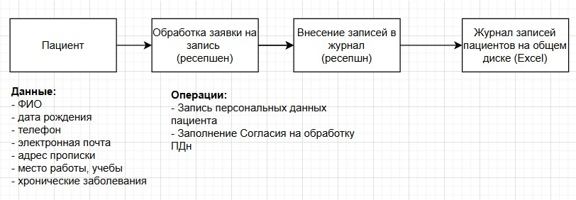
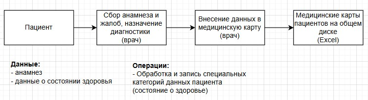
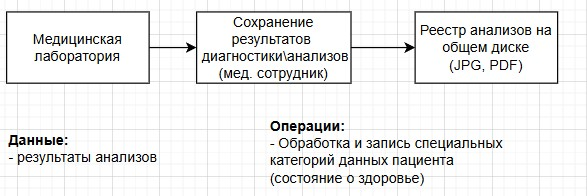
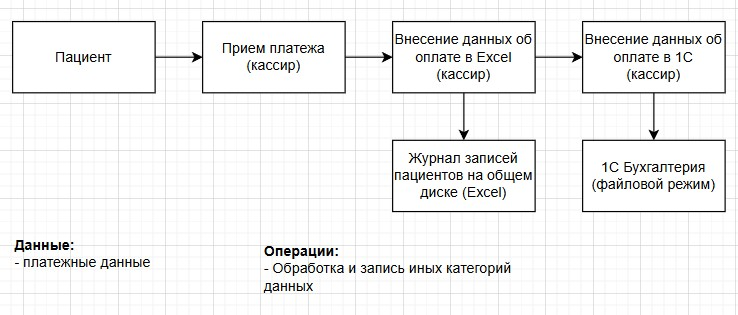
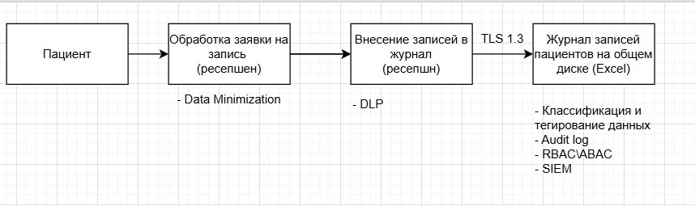
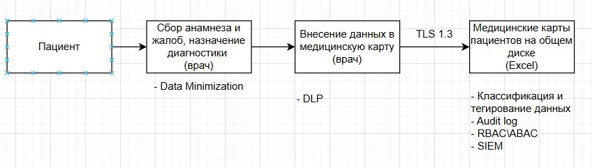
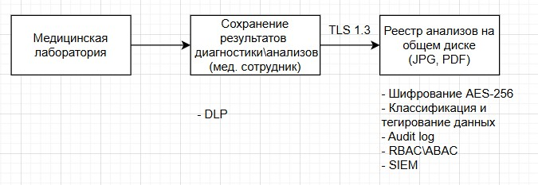
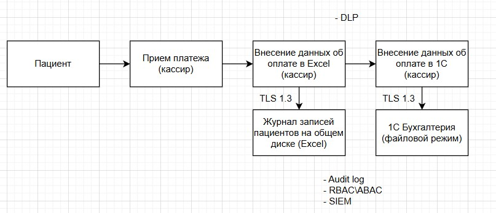

# Задание 1. Анализ безопасности системы

Чтобы заниматься реализацией новых продуктов, которые основаны на данных, необходимо системно решить проблему хранения конфиденциальных данных и управления ими. 
Сейчас данные лежат в непосредственной близости к пользователям, поэтому существует риск утечки данных и неправомерного использования информации.

Чтобы защитить данные, используйте механизмы, инструменты и принципы работы с конфиденциальными данными, например, подходы Privacy By Design, Data Minimization и Data Lineage.

В рамках этого задания вам нужно проанализировать состояние As-Is, чтобы впоследствии приступить к его доработке.

## Что нужно сделать

1. Выявите конфиденциальные данные, которые не учтены во внутренних системах.
   - Проанализируйте информацию о компании.
   - Создайте диаграммы потоков данных (Data Flow Diagrams). Для каждого процесса создайте отдельную диаграмму.
   - Отобразите на них, как данные перемещаются по системам компании и какие операции над ними совершают.
2. Проведите аудит мер по обеспечению безопасности данных.
    - Сопоставьте процессы в компании с требованиями по обеспечению безопасности данных и архитектурными практиками в области безопасности конфиденциальных данных.
    - Составьте список проблемных зон и сохраните его в отдельный документ.
3. Подумайте, что можно улучшить.
    - Составьте список данных для защиты и проставьте для каждого способы защиты — шифрование, обфускация, обезличивание.
    - Разработайте механизм тегирования данных с использованием инструментов тегирования.
    - Составьте список инструментов, способов и мер, которые позволят обеспечить конфиденциальность данных в указанных потоках.
    - Доработайте диаграммы из предыдущего шага: отобразите на них, что следует использовать на каждом этапе потока.

## Решение

### 1. Диаграммы потоков данных

Процесс "Запись пациента на прием"

Процесс "Ведение медицинской карты"

Процесс "Обработка результатов диагностики из лаборатории"

Процесс "Прием оплаты"

### 2. Аудит мер по обеспечению безопасности данных

#### Сопоставление процессов с требованиями 152-ФЗ

| Требование 152-ФЗ         | Текущее состояние                                        |
|---------------------------|----------------------------------------------------------|
| Законность обработки      | Согласие на обработку ПДн собирается                     |
| Условия обработки ПДн     | Данные обрабатываются без четкого документирования целей |
| Согласие субъекта         | Согласие не стандартизировано, хранится в разных формах  |
| Специальные категории ПДн | Данные о здоровье хранятся в открытом доступе            |
| Локализация ПДн           | Данные хранятся локально в РФ                            |
| Обеспечение безопасности  | Отсутствует шифрование и контроль доступа                |
| Уничтожение ПДн           | Отсутствует                                              |

#### Сопоставление процессов архитектурным практикам безопасности

| Практика                 | Текущее состояние                                                          |
|--------------------------|----------------------------------------------------------------------------|
| Privacy by Design        | Не применяется, данные собираются без учета защиты на этапе проектирования |
| Data Minimization        | Собирается избыточная информация, нет политики минимизации                 |
| Data Lineage             | Отсутствует, невозможно отследить кто и когда обращался к данным           |
| RBAC/ABAC                | Отсутствует, только доменная аутентификация                                |
| Шифрование данных        | Отсутствует, данные в открытых источниках (Excel, JPG, PDF)                |
| Аудит доступа            | Отсутствует                                                                |
| Разделение сред          | Отсутствует, все на одном сервере                                          |
| Управление уязвимостями  | Отсутствует                                                                |

### 3. Рекомендации по улучшению

### Список данных для защиты

| Категория данных    | Примеры                     | Шифрование           | Обфускация                | Обезличивание           |
|---------------------|-----------------------------|----------------------|---------------------------|-------------------------|
| ФИО                 | Иванов Иван Иванович        | AES-256 при хранении | Маскировка (Иван***)      | Замена на идентификатор |
| Телефон             | +7 (999) 123-45-67          | AES-256 при хранении | Маскировка (+7 XXX-XXX--) | Хеширование             |
| Email               | user@mail.ru                | AES-256 при хранении | Маскировка (u***@mail.ru) | Хеширование             |
| Адрес               | г. Москва, ул. Ленина, д. 1 | AES-256 при хранении | Удаление точного адреса   | До уровня города        |
| Дата рождения       | 01.01.1990                  | AES-256 при хранении | Маскировка (01.01.****)   | До года                 |
| Данные о здоровье   | Диагнозы, анализы           | AES-256 при хранении | Не применяется            | Полное обезличивание    |
| Результаты анализов | Показатели                  | AES-256 при хранении | Не применяется            | Полное обезличивание    |
| Платeжные данные    | Номер карты                 | AES-256 при хранении | Маскировка (--****-1234)  | Токенизация             |
| История записей     | Дата, время, врач           | AES-256 при хранении | Агрегация                 | По истечении срока      |

### Механизм тегирования данных

| Тег          | Уровень           | Описание                              | Примеры                                   |
|--------------|-------------------|---------------------------------------|-------------------------------------------|
| PUBLIC       | 	Публичные        | 	Данные доступные всем                | Публичная информация о клинике, о врачах  |
| INTERNAL     | 	Внутренние       | 	Данные для внутреннего использования | Расписание                                |
| CONFIDENTIAL | 	Конфиденциальные | 	Данные с ограниченным доступом       | ФИО, контактные данные                    |
| RESTRICTED   | 	Ограниченные     | 	Строго ограниченный доступ           | Медицинские карты, диагнозы               |
| CRITICAL     | 	Критические      | 	Максимальный уровень защиты          | Платёжные данные                          |

### Список инструментов, способов и мер, которые позволят обеспечить конфиденциальность данных

| Мера \ способ                 | Назначение                                                |
|-------------------------------|-----------------------------------------------------------|
| Data Lineage                  | Отслеживание жизненного цикла данных                      | 
| Шифрование AES-256            | Шифрование данных при хранении                            |
| TLS 1.3                       | Шифрование данных при передаче                            |
| RBAC\ABAC                     | Управление доступов на основе ролей или атрибутов         |
| API-Gateway                   | Централизированный контроль API доступа                   |
| Data Classification \ Tagging | Классификация и тегирование данных                        |
| Audit log \ SIEM              | Аудит доступ и мониторинг событий                         |
| DLP-система                   | Контроль утечек данных                                    |
| Data Minimization             | Сбор минимально необходимых данных                        |
| Data masking\Data obfuscation | Маскировка ПДн в тестовых средах                          |
| Tokenization                  | Токенизация платежных данных в тестовых средах            |

### 1. Диаграммы потоков данных c необходимыми мерами защиты для них

Процесс "Запись пациента на прием"

Процесс "Ведение медицинской карты"

Процесс "Обработка результатов диагностики из лаборатории"

Процесс "Прием оплаты"

