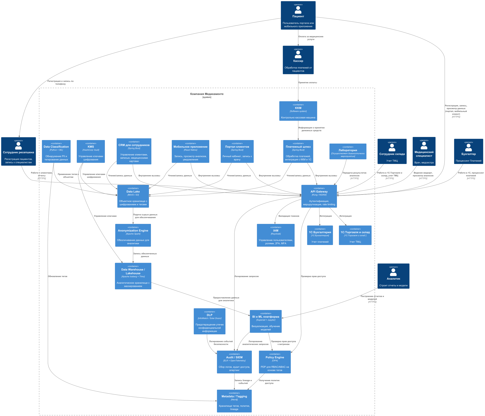

# Задание 2. Проектирование решения

Используя подход Privacy by Design, проведите анализ и предложите механизмы для предупреждения возможных рисков, связанных с конфиденциальностью. 
Ваша задача — спроектировать механизмы управления такими рисками до момента реализации изменений в проектируемой системе.

В рамках этого задания вам нужно проанализировать состояние As-Is и оценить, как спроектировать решение с учётом требований To-Be.11

### Что нужно сделать

1. Предложить новые блоки в архитектуру проектируемой системе С4, которые обеспечат соблюдение принципов Privacy By Design во многих блоках реализуемой системы.
2. Предложить в целевой архитектуре слой, который обеспечивает аналитическую работу с данными системы с учётом принципов Privacy by Design.

### Решение

Архитектура TO-BE с учётом принципов Privacy by Design

                               |                                                                                                                                                                                                                    |