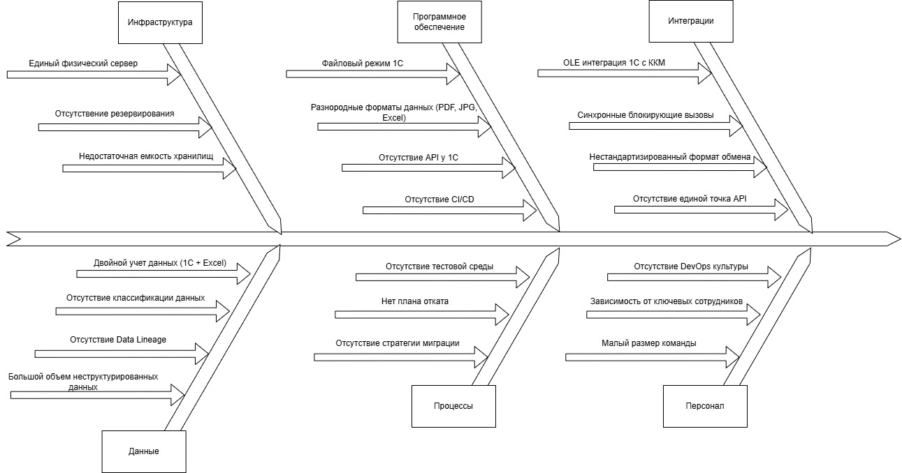

# Задание 4. Оценка узких мест при миграции

В компании планируется миграция устаревшей монолитной системы на современную архитектуру (например, на микросервисную). 
В процессе перехода необходимо выявить потенциально узкие места, которые могут негативно повлиять на работоспособность нового решения.

### Что нужно сделать

1. Проанализировать ситуацию.
   - Изучить описание текущей системы и целей миграции.
   - Определить ключевые процессы и компоненты, затрагиваемые миграцией (например, базы данных, коммуникационные каналы, серверное оборудование, бизнес-логика).
2. Построить диаграмму Исикавы.
   Построить диаграмму «Рыбья кость» (Ishikawa) для выявления потенциальных причин узких мест.
3. Выделить основные категории и для каждой указать возможные проблемы.
   Например, «Инфраструктура», «Программное обеспечение», «Интеграция», «Персонал», «Процессы».
4. Предложить рекомендации.
   - Составить краткий список мер по устранению выявленных узких мест на основе диаграммы.
   - Оценить приоритетность этих мер.
5. Сформировать отчёт.
   - Представить диаграмму Исикавы (draw.io).
   - Описать выявленные проблемы и предложенные решения в виде отчёта. Ревьюер будет смотреть на системность и глубину проработки возможных рисков снижения производительности системы.

### Решение 

#### Диаграмма Ishikawa

#### Анализ проблем и рекомендации по их устранению

| Проблема                                           | Описание                                                                               | Влияние                                                                                       | Приоритет    | Мера                                                                                                                 |
|----------------------------------------------------|----------------------------------------------------------------------------------------|-----------------------------------------------------------------------------------------------|--------------|----------------------------------------------------------------------------------------------------------------------|
| 1. Инфраструктура                                  |                                                                                        |                                                                                               |              |                                                                                                                      |
| 1.1 Единый физический сервер                       | Все сервисы и данные размещены на одном сервере                                        | При отказе сервера все процессы компании останавливается                                      | Критический  | Переход на Kubernetes инфраструктуру из нескольких узлов (on-premise или облако)                                     |
| 1.2 Отсутствение резервирования                    | Нет резервных каналов связи                                                            | Риск длительных простоев                                                                      | Высокий      | Организовать резервные интернет каналы, разделение инфраструктуры на несколько ЦОД (облако)                          |
| 1.3 Недостаточная емкость хранилищ                 | Текущие сервера не рассчитаны на хранение исторических данных, аналитических витрин    | Потребуются дополнительные затраты на расширение или миграцию в облако                        | Высокий      | Миграция данных в S3 совместимое объектное хранилище                                                                 |
| 2. Программное обеспечение                         |                                                                                        |                                                                                               |              |                                                                                                                      |
| 2.1 Файловый режим 1С                              | При одновременной работе 5+ пользователей производительность падает, блокировки таблиц | Критично для масштабирования                                                                  | Критический  | Перевод 1С в клиент-серверный режим                                                                                  |
| 2.2 Отсутствие API у 1С                            | Интеграция с новыми сервисами возможна только через OLE или выгрузку файлов            | Затрудняет построение микросервисной архитектуры                                              | Критический  | Разработка REST API для 1С                                                                                           |
| 2.3 Разнородные форматы данных (PDF, JPG, Excel)   | Данные разбросаны по разным файлам без единой схемы                                    | Усложняет ETL процессы и построение Data Lake                                                 | Высокий      | Стандартизация форматов данных	                                                                                      |
| 2.4 Отсутствие CI/CD                               | Нет автоматизированных пайплайнов сборки, тестирования и развёртывания                 | Замедляет внедрение изменений, увеличивает риск ошибок                                        | Высокий      | Внедрение CI/CD                                                                                                      |
| 3. Интеграции                                      |                                                                                        |                                                                                               |              |                                                                                                                      |
| 3.1 OLE интеграция 1С с ККМ                        | Устаревший протокол OLE не поддерживающая современные стандарты безопасности           | Риск сбоев при интеграции, сложность замены ККМ                                               | Критический  | Замена OLE на REST/WebSocket                                                                                         |
| 3.2 Отсутствие единой точка API                    | Нет единой точки входа для внешних и внутренних API запросов                           | Невозможно контролировать доступ, маршрутизацию, логирование                                  | Критический  | Внедрение API Gateway                                                                                                |
| 3.3 Синхронные блокирующие вызовы                  | Все интеграции строятся на синхронных запросах                                         | При росте нагрузки сервисы будут блокировать друг друга, нет очередей для асинхронных вызовов | Высокий      | Внедрение очередей сообщений, переход на асинхронное взаимодействие                                                  |
| 4. Данные                                          |                                                                                        |                                                                                               |              |                                                                                                                      |
| 4.1 Двойной учет данных (1С + Excel)               | Данные дублируются                                                                     | Рассинхронизация, избыточность. При миграции нет единой точки консистентности                 | Критический  | Устранение двойного учёта. Определение master источника данных: 1С - для финансов, Data Lake - для клиентских данных |
| 4.2 Отсутствие классификации и теггирования данных | Данные не классифицированы на уровни критичности содержащихся в них данных             | Невозможно разделить доступ к на основе уровня безопасности                                   | Высокий      | Внедрение системы классификация и теггирования поступающих данных                                                    |
| 4.3 Отсутствие Data Lineage                        | Невозможно отследить происхождение и трансформации данных                              | Сложность отладки                                                                             | Высокий      | Внедрение Data Lineage                                                                                               |
| 4.4 Большой объем неструктурированных данных       | Сканы, фотографии, PDF без метаданных                                                  | Усложняет индексацию, поиск и аналитику                                                       | Средний      | Разработка ETL пайплайнов на основе Apache Spark для миграции данных                                                 |
| 5. Процессы                                        |                                                                                        |                                                                                               |              |                                                                                                                      |
| 5.1 Отсутствие стратегии миграции                  | Нет плана миграции данных из различных форматов данных                                 | Требуется четкий план с плавной миграцией данных                                              | Критический  | Выбор стратегии миграции Strangler Fig для постепенной замены монолита микросервисами                                |
| 5.2 Нет плана отката                               | При сбое непонятно, как вернуться к старой версии                                      | Риск длительных простоев и потери данных                                                      | Критический  | Разработка плана отката, для каждого этапа миграции чёткий сценарий возврата                                         |
| 5.3 Отсутствие тестовой среды                      | Нет окружения, приближенного к боевому                                                 | Ошибки обнаруживаются только в production                                                     | Высокий      | Создание тестовой окружения идентичное боевому, для нагрузочного и приемочного тестирования                          |
| 6. Персонал                                        |                                                                                        |                                                                                               |              |                                                                                                                      |
| 6.1 Малый размер команды                           | Текущий IT-отдел состоит из 3 сотрудников                                              | Задержки в разработке                                                                         | Критический  | Найм новых специалистов                                                                                              |
| 6.2 Зависимость от ключевых сотрудников            | Только 1–2 человека знают, как всё устроено                                            | Риск при увольнении ключевых сотрудников                                                      | Высокий      | Создание центров компетенций, выделение экспертов по каждому направлению                                             |
| 6.3 Отсутствие DevOps-культуры                     | Нет практик автоматизации, мониторинга, алертинга                                      | Усложняет эксплуатацию микросервисов                                                          | Высокий      | Обучение текущей команды                                                                                             |